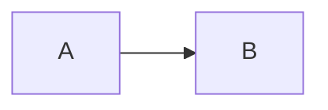

+++
categories = [""]
date = {{ .Date }}
# lastmod = "" # Optional: set ONLY when meaningfully editing a published post (typos/grammar
# don't count). Surfaces as dateModified in JSON-LD Schema.org and as the visible "Updated"
# label on the post when it's ≥24h after `date`. If omitted, Hugo falls back to `date` and
# both the schema field and the visible label are suppressed (no fake freshness signal).
# Format same as `date`, e.g. lastmod = 2026-01-15T10:00:00Z.
description = ""
draft = true
image = "/blog/{{ .File.ContentBaseName }}/cover.jpg"
tags = [""]
title = "{{ replace .File.ContentBaseName "-" " " | title }}"
# toc = true # Optional: render a <nav> Table of Contents (built from H2-H4 headings) at the
# top of the post. Off by default. Helps LLMs ground citations to specific sections of long
# posts and gives readers a quick map. Safe to enable on any post with ≥2 H2s; falls back to
# nothing if the post has no headings.
type = "post"
+++

<!--
================================================================================
Quick markdown cheatsheet — delete this block before publishing.

## Headings (use H2+, H1 is reserved for the title)
### Subheading

**bold**  *italic*  ~~strike~~  `inline code`

[Link text](https://example.com)
              # relative to this Page Bundle

- bullet
1. numbered

> blockquote

```python
print("code block with syntax highlight")
```



| col1 | col2 |
|------|------|
| a    | b    |

Full reference: see content/blog/_markdown-reference.md
================================================================================
-->

Write your post here.
