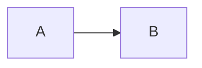

+++
categories = [""]
date = {{ .Date }}
description = ""
draft = true
image = "/blog/{{ .File.ContentBaseName }}/cover.jpg"
tags = [""]
title = "{{ replace .File.ContentBaseName "-" " " | title }}"
type = "post"
+++

<!--
================================================================================
Quick markdown cheatsheet — delete this block before publishing.

## Headings (use H2+, H1 is reserved for the title)
### Subheading

**bold**  *italic*  ~~strike~~  `inline code`

[Link text](https://example.com)
              # relative to this Page Bundle

- bullet
1. numbered

> blockquote

```python
print("code block with syntax highlight")
```



| col1 | col2 |
|------|------|
| a    | b    |

Full reference: see content/blog/_markdown-reference.md
================================================================================
-->

Write your post here.
