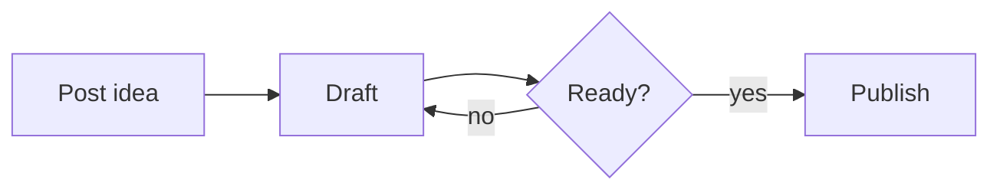

+++
categories = ["Reference"]
date = 2022-01-01T00:00:00Z
description = "Personal markdown cheatsheet — how every formatting feature looks on this blog. Not published."
draft = true
image = "/uploads/post/the-definitive-guide-to-graph-problems/cover.png"
tags = ["Markdown"]
title = "Markdown Reference (Personal Cheatsheet)"
type = "post"
+++

This file is a **personal reference**. It has `draft = true`, so Netlify ignores it. Use `hugo server -D` to preview it locally and see how each markdown feature renders on this blog.

## Headings

```
# H1 (don't use — reserved for the post title)
## H2
### H3
#### H4
```

## H2 example

### H3 example

#### H4 example

## Text formatting

**Bold text** with `**asterisks**`.

*Italic text* with `*single asterisks*` or `_underscores_`.

***Bold and italic*** with `***triple asterisks***`.

~~Strikethrough~~ with `~~tildes~~`.

`inline code` with backticks.

Superscript via raw HTML: x<sup>2</sup>. Subscript: H<sub>2</sub>O.

## Links

External: [Hugo docs](https://gohugo.io/documentation/).

Internal (relative): [my Go post](/blog/my-first-time-learning-go/).

Bare URL: <https://giulianopertile.com>.

## Images

Standard markdown image (site-absolute path):

```markdown

```


> Convention: post images live in `static/uploads/post/<slug>/` and are referenced as `/uploads/post/<slug>/<file>`.

## Lists

Unordered:

- First item
- Second item
  - Nested item
  - Another nested item
- Third item

Ordered:

1. Step one
2. Step two
3. Step three

Task list (GitHub-flavored):

- [x] Done
- [ ] Pending
- [ ] Also pending

## Blockquotes

> This is a blockquote. Useful for highlighting key insights or quoting sources.
>
> Multiple paragraphs work if you keep the `>` prefix.

Nested:

> Outer
>
> > Inner

## Code blocks

Inline: `print("hello")`.

Fenced with language for syntax highlighting (Chroma `manni` theme is configured):

```python
from dataclasses import dataclass

@dataclass
class Post:
    title: str
    slug: str
    draft: bool = False
```

```go
package main

import "fmt"

func main() {
    fmt.Println("Hello, blog")
}
```

```bash
hugo server -D
hugo --minify --gc
```

```toml
+++
title = "Example"
date = 2026-01-01T00:00:00Z
+++
```

## Mermaid diagrams

Code-fenced with `mermaid` triggers the custom render hook (`layouts/_default/_markup/render-codeblock-mermaid.html`):



## Tables

| Column A | Column B    | Column C |
|----------|-------------|----------|
| Row 1    | data        | more     |
| Row 2    | extra info  | here     |
| Row 3    | last        | row      |

Alignment:

| Left | Center | Right |
|:-----|:------:|------:|
| foo  |  bar   |   baz |

## Horizontal rule

Three or more dashes on their own line:

---

Above and below this rule.

## Footnotes

Here's a sentence with a footnote.[^1]

And another one.[^longer-id]

[^1]: First footnote text.
[^longer-id]: Footnotes can have longer ids and span multiple lines if indented properly.

## Raw HTML (use sparingly)

Sometimes markdown isn't enough — raw HTML works because of `ignoreLogs = ['warning-goldmark-raw-html']` in `config.toml`:

<details>
<summary>Click to expand</summary>

Hidden content goes here. Useful for spoilers, long examples, or optional context.

</details>

<kbd>Ctrl</kbd> + <kbd>C</kbd> for keyboard shortcuts.

## Definition lists (extension)

Term
: Definition of the term.

Another term
: Another definition.

## Emoji (Unicode, no plugin)

Just paste them directly: 🎉 🐍 🚀 ✅ ❌

## Front matter cheatsheet

The TOML block at the top of every post:

```toml
+++
categories = ["Programming"]    # shown as tags on the post + groups it in /categories/
date = 2026-05-27T00:00:00Z     # RFC3339 — controls publish order
description = "One-liner used in meta tags + OG cards + homepage summary"
image = "/uploads/post/<slug>/cover.jpg"
tags = ["Python", "Algorithms"]
title = "Title in Title Case"
type = "post"                   # "post" for normal posts, "featured" for the hero on home
draft = false                   # set true while writing
# disableShare = true           # uncomment to hide social share buttons
+++
```
