+++
categories = ["Programming"]
date = 2022-09-17T03:00:00Z
description = "Do you want to learn how to solve graph problems? Are you preparing for a coding interview? Do you want to polish your problem-solving skills? In this article I will try to answer these questions and more, and you will learn the patterns necessary to deal with these problems."
image = "/uploads/post/the-definitive-guide-to-graph-problems/cover.png"
tags = ["Python", "Algorithms"]
title = "The Definitive Guide to Graph Problems"
type = "featured"
# disableShare = true # disable share buttons
+++

Do you want to learn how to solve graph problems? Are you preparing for a coding interview? Do you want to polish your problem-solving skills? In this article I will try to answer these questions and more, and you will learn the patterns necessary to deal with these problems.

## What is a Graph?

A Graph is a data structure consisting of **Nodes** (or vertices) and **Edges**. This data structure is often use as a way to represent distances or different connections.

For example the distances between cities, with arbitrary distances.

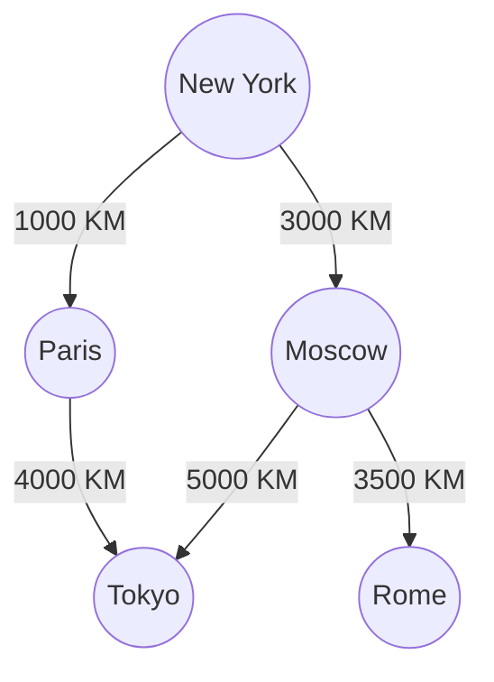
With a graph you can know things like, the distance from New York to Paris, and from Paris to Tokyo, also, thanks to the graph you know that if you can go from New York to Paris and from Paris to Tokyo, you can go from New York to Tokyo.

- **Nodes:** a node (normally the circles in the graph) can have a value, for example a letter or a number, or have not value at all.
- **Edges:** the edges (or arrows) are the lines that connect one node with another one. An edge can have a value, this value may represent some sort o distance.

More formally a Graph is composed of a set of Nodes(N) and a set of edges(E).

## Graph in the context of coding interviews

During technical interviews you are often asked to solve coding challenges. And you must have a good understanding of graph algorithms if you want to do well in these challenges.

Graph are often a topic present in coding interviews, so here I want to show you how to tackle these problems and the different patterns that you need to know or be aware of.

I recommend reading the topics in this article in order, as we will develop the subject progressively and the understanding of the first exercises are the basis for the following ones.


## Problem solutions

All the solutions to the problems presented in this article can be found in this [GitHub Repository](https://github.com/francofgp/The-Definite-Guide-to-Graph-Problems)

## How do you traverse a graph?

When traversing a graph there are two main techniques, known as **Breadth-First-Search** and **Depth-First-Search**, this is the fundamental block that you will use in most graph problems.

### Breadth-First-Search (BFS)

**Breadth-First-Search (BFS)** is an algorithm for searching a tree data structure for a node that satisfies a given property.
It starts at the tree root (or the node that you want) and explores all nodes at the present depth prior to moving on to the nodes at the next depth level.

Extra memory, usually a **queue**, is needed to keep track of the child nodes that were encountered but not yet explored.

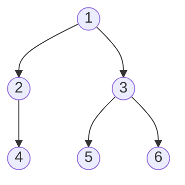

The result of the BFS algorithm will be **--> 1, 2, 3, 4, 5, 6.**

To implement a BFS algorithm, you have to follow the next steps:

- Declare a queue and insert the starting node.
<!-- - Initialize a visited array and mark the starting vertex as visited. -->
- While the queue is not empty you remove the first node of the queue.
<!-- - Mark that vertex as visited.
 -->
- Insert all the neighbors of the node into the queue.

**All of the algorithms will be presented in python, feel free to implement them in your favorite language**

#### BFS Code implementation

```python
def breadth_first_search(graph,starting_node):
    queue = [starting_node] # Declare a queue and insert the starting node.
    while len(queue) > 0: # While the queue is not empty you remove the first node of the queue.
        current_node = queue.pop(0) 
        print(current_node)
        for neighbor in graph[current_node]:
            queue.append(neighbor) # Insert all the neighbors of the node into the queue.

graph = {
    1: [2, 3],
    2: [4],
    3: [5, 6],
    4: [],
    5: [],
    6: [],
}
breadth_first_search(graph, 1)
# 1 2 3 4 5 6
```
##### Time and Space Complexity

- Time Complexity of BFS: **O(V+E)** where V is vertices (nodes) and E is edges, since you must go through all the nodes and edges of the graph

- Space Complexity of BFS: **O(V)** where V is vertices (nodes), since the queue will have at most V elements

### Depth-First-Search (DFS)

**Depth-First-Search (DFS)** is an algorithm for traversing or searching tree or graph data structures.

The algorithm starts at the root node (selecting some arbitrary node as the root node in the case of a graph) and explores as far as possible along each branch before backtracking.

Extra memory, usually a **stack**, is needed to keep track of the nodes discovered so far along a specified branch which helps in backtracking of the graph.


The result of the DFS algorithm will be **--> 1, 3, 6, 5, 2, 4.**

To implement a DFS algorithm, you have to follow the next steps:

For the **iterative solution**:

- Declare a stack and insert the starting node.
- While the stack is not empty you remove the last node of the stack.
- Insert all the neighbors of the node into the queue.

For the **recursive solution**:

- Create a recursive function that takes in the graph and the starting node.
- Create your base cases.
- Traverse all the neighboring nodes and call the recursive function with the index of the neighboring node.

#### DFS Code implementation, Iterative

```python
def depth_first_search(graph,starting_node):
    queue = [starting_node] # Declare a stack and insert the starting node.
    while len(queue) > 0: # While the stack is not empty you remove the last node of the stack.
        current_node = queue.pop() 
        print(current_node)
        for neighbor in graph[current_node]:
            queue.append(neighbor) # Insert all the neighbors of the node into the queue.

graph = {
    1: [2, 3],
    2: [4],
    3: [5, 6],
    4: [],
    5: [],
    6: [],
}
breadth_first_search(graph, 1)
# 1 3 6 5 2 4  # It does not matter if you start with the right neighbor or with the left one
```

#### DFS Code implementation, Recursion

```python
def depth_first_search(graph,starting_node):
    # Create a recursive function that takes in the graph and the starting node.
    print(starting_node)
    for neighbor in graph[starting_node]: 
        # Create your base cases. In this case my base is when the for loop contains zero elements.
        # When that is the case I do not call the breadth_first_search function
        # Traverse all the neighboring nodes and call the recursive function with the index of the neighboring node.
        depth_first_search(graph, neighbor)

graph = {
    1: [2, 3],
    2: [4],
    3: [5, 6],
    4: [],
    5: [],
    6: [],
}
breadth_first_search(graph, 1)
# 1 2 4 3 5 6 
```
##### Time and Space Complexity

- Time Complexity of DFS: **O(V+E)** where V is vertices (nodes) and E is edges, since you must go through all the nodes and edges of the graph

- Space Complexity of DFS: **O(V)** where V is vertices (nodes), since the stack will have at most V elements

## Adjacency List as my Graph representation

Sometimes we may be given an input that is not what we expect, or that is difficult to work with. One of the easiest ways to work with graphs is with an **adjacency list**.

Suppose we have an input like the one below.

```python
edges = [
    ["1", "2"],
    ["2", "3"],
    ["5", "3"],
    ["5", "4"],
    ["1", "4"]
]
```
Where the first element of the array, **["1", "2"]**, reads as, node one connects to node 2, and node 2 connects to node 1. To transform this input into an adjacency list we can create a function like `create_graph`, to transform the array into an adjacency list that is easier to work with.


```python
edges = [
    ["1", "2"],
    ["2", "3"],
    ["5", "3"],
    ["5", "4"],
    ["1", "4"]
]
def create_graph(edges):
    graph = {}
    for edge in edges:
        node_a, node_b = edge
        if node_a not in graph:
            graph[node_a] = []
        if node_b not in graph:
            graph[node_b] = []
        graph[node_a].append(node_b)
        graph[node_b].append(node_a)
    return graph

print(create_graph(edges))
```
And the output is:

```python
{
    '1': ['2', '4'], 
    '2': ['1', '3'], 
    '3': ['2', '5'], 
    '5': ['3', '4'], 
    '4': ['5', '1']
}
```
In this way we can deal with these problems without having to worry about the shape of the input.

## Let's practice the traversal

Now we need to put into practice what we have learned with an exercise.

### Has path?

We are going to write a function `has_path` that takes a dictionary or object representing the adjacency list of a graph, and the parameters will be `(starting_node, destination)`.
The function must return a `True` value whether there is a directed path between the source node and the destination node, otherwise we should return `False`

This is the input graph

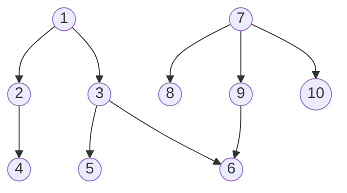

#### Has path Code implementation

We are going to implement the solution using BFS and DFS (recursively and iteratively).

The process is quite straightforward, we need to implement the same algorithm we implemented above, but searching for the destination node.
Feel free to give it a try on your own before jump into the solution 😋.

##### BFS Iterative Solution

```python
def has_path(graph, starting_node, destination):
    # The first think we do is to ask if the starting node and destination are the same
    if starting_node == destination: 
        return True
    queue = [starting_node]
    while len(queue) > 0:
        current_node = queue.pop(0) 
        if current_node == destination:
            # We keep asking if they are the same with every new node in the queue
            return True
        for neighbor in graph[current_node]:
            queue.append(neighbor)

    # If we couldn't find the destination node from the starting node 
    # we return false
    return False

graph = {
    1: [2, 3],
    2: [4],
    3: [5, 6],
    4: [],
    5: [],
    6: [],
    7: [8, 9, 10],
    8: [],
    9: [6],
    10: [],
}
has_path(graph, starting_node = 7, destination = 6)
# True
```

##### DFS Iterative Solution

As we can see, this is essentially the same code, except with an stack instead of a queue data structure.

```python
def has_path(graph, starting_node, destination):
    # The first think we do is to ask if the starting node and destination are the same
    if starting_node == destination: 
        return True
    stack = [starting_node] # the only difference with a BFS is the stack
    while len(stack) > 0:
        current_node = stack.pop() 
        if current_node == destination:
            # We keep asking if they are the same with every new node in the queue
            return True
        for neighbor in graph[current_node]:
            stack.append(neighbor)

    # If we couldn't find the destination node from the starting node 
    # we return false
    return False
    
graph = {
    1: [2, 3],
    2: [4],
    3: [5, 6],
    4: [],
    5: [],
    6: [],
    7: [8, 9, 10],
    8: [],
    9: [6],
    10: [],
}
has_path(graph, starting_node = 7, destination = 6)
# True
```

##### DFS Recursive Solution

Here we are going to implement the DFS algorithm using a recursive approach.

```python
def has_path(graph, starting_node, destination):
    # The first think we do is to ask if the starting node and destination are the same
    if starting_node == destination: 
        return True
    for neighbor in graph[starting_node]:
        # Here we call the same function, has_path, for all of the neighbors of a given node
        # This function return true or false if we find such node.
        if has_path(graph, neighbor, destination):
            return True

    # If we couldn't find the destination node from the starting node 
    # we return false
    return False
    
graph = {
    1: [2, 3],
    2: [4],
    3: [5, 6],
    4: [],
    5: [],
    6: [],
    7: [8, 9, 10],
    8: [],
    9: [6],
    10: [],
}
has_path(graph, starting_node = 7, destination = 6)
# True
```

## Undirected Graph and the Visited Pattern

So far we have seen **directed graph**, that is, from one node to another node there is only one direction, consider the next example:

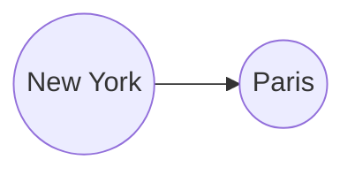
In this example you can go from New York to Paris, but not the other way around.


An **undirected graph** is a graph, where all the edges are bidirectional.

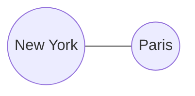

In this example 👆, you can go from New York to Paris, and from Paris to New York.

But what is the **Visited Pattern**?

As you can imagine, now we need to find some way to know which nodes we visit and which we don't, so we can avoid infinite loops.

Generally a solution to this is to use a **set**, which allows us to have constant lookups, that is access to an element in constant time.

Let's practice some exercises.

### Exercises

Here we will practice some exercises using BFS and DFS, and we will implement the visited pattern.
Again, feel free to try to solve these exercises on your own before jump into the code.

I will explain in the code the new lines that we need to solve the problem and potential gotchas.


#### Find a path Between node A and B in a undirected Graph

This problem is similar to the **Has Path** problem presented above, but with the difference that we have an undirected node, so we have to pay attention to the nodes we visit, in order not to fall into an infinite loop.

We are going to write a function `has_path` that takes a dictionary or object representing the adjacency list of a graph, and the parameters will be `(starting_node, destination)`.
The function must return a `True` value whether there is a directed path between the source node and the destination node, otherwise we should return `False`

Our input graph is the following:

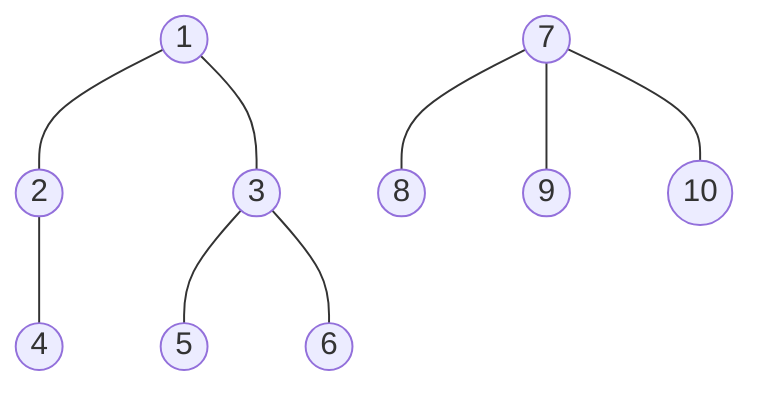

The new concepts to keep in mind are the following:

- We need to create a data structure to keep track of the visited node, typically a **set**.
- When we loop through the neighbors of our current node, we need to ask if that node has already been visited.
- If the node has been visited, we skip the node (this may depend of the problem).
- After we check that our node has not been visited yet, we mark it as visited.

##### BFS Solution - Has Path - Undirected Graph

We implement the **BFS** algorithm as we have seen before, but we add a new element, the visited set, to keep track of our visited nodes.

```python
def has_path(graph, starting_node, destination):
    visited = set() # Set to keep track our visited nodes
    if starting_node == destination:
        return True
    queue = [starting_node]
    while len(queue) > 0:
        current_node = queue.pop(0) 

        # Ask if our current node has been visited
        # if it has been visited, we skip this node
        if current_node in visited: 
            continue
        # add our current node to the visited set
        visited.add(current_node) 

        if current_node == destination:
            return True
        for neighbor in graph[current_node]:
            queue.append(neighbor)

    return False
graph = {
    1: [2, 3],
    2: [1, 4],
    3: [1, 5, 6],
    4: [2],
    5: [3],
    6: [3],
    7: [8, 9, 10],
    8: [7],
    9: [7],
    10: [7],
}
has_path(graph, starting_node = 2, destination = 6)
# True
```

##### DFS Iterative Solution - Has Path - Undirected Graph

This solution is similar to the BFS approach, but using an stack instead of a queue.

```python
def has_path(graph, starting_node, destination):
    visited = set() # Set to keep track our visited nodes
    if starting_node == destination:
        return True
    stack = [starting_node] #We use a stack instead of a queue for the DFS algorithm
    while len(stack) > 0:
        current_node = stack.pop() 

        # Ask if our current node has been visited
        # if it has been visited, we skip this node
        if current_node in visited: 
            continue
        # add our current node to the visited set
        visited.add(current_node) 

        if current_node == destination:
            return True
        for neighbor in graph[current_node]:
            stack.append(neighbor)

    return False
graph = {
    1: [2, 3],
    2: [1, 4],
    3: [1, 5, 6],
    4: [2],
    5: [3],
    6: [3],
    7: [8, 9, 10],
    8: [7],
    9: [7],
    10: [7],
}
has_path(graph, starting_node = 2, destination = 6)
# True
```

##### DFS Recursive Solution - Has Path - Undirected Graph - Variation # 1

We implement a recursive approach to look for the visited nodes, we also add a new parameter to our function, a set, to keep track of the node that we have seen.

```python
# We add a new parameter called visited, to keep track of our visited nodes.
# We pass an empty visited set to our function for the first time.
def has_path(graph, starting_node, destination, visited = set()):
    # The first think we do is to ask if the starting node and destination are the same
    if starting_node == destination: 
        return True
    # we checked if our starting node has been visited, if it has
    # we return False
    if starting_node in visited:
        return False
    visited.add(starting_node)
    for neighbor in graph[starting_node]:
        if has_path(graph, neighbor, destination, visited):
            return True

    return False

graph = {
    1: [2, 3],
    2: [1, 4],
    3: [1, 5, 6],
    4: [2],
    5: [3],
    6: [3],
    7: [8, 9, 10],
    8: [7],
    9: [7],
    10: [7],
}
has_path(graph, starting_node = 10, destination = 8)
# True
```

##### DFS Recursive Solution - Has Path - Undirected Graph - Variation # 2

This is a slight variation of the recursive DFS recursive approach.
The main difference is that we check if the node has been visited when we loop the neighbors of our current node.

```python
def has_path(graph, starting_node, destination, visited = set()):
    # The first think we do is to ask if the starting node and destination are the same
    if starting_node == destination: 
        return True
    for neighbor in graph[starting_node]:
        # We ask if our neighboring node has been visited
        if neighbor in visited:
            continue
        # we mark our neighbor has visited, so that in the next recursion call
        # we ask if it is the node that we are looking for
        visited.add(neighbor)
        if has_path(graph, neighbor, destination, visited):
            return True

    return False

graph = {
    1: [2, 3],
    2: [1, 4],
    3: [1, 5, 6],
    4: [2],
    5: [3],
    6: [3],
    7: [8, 9, 10],
    8: [7],
    9: [7],
    10: [7],
}
has_path(graph, starting_node = 10, destination = 8)
# True
```

#### Count Components

In this exercise we will have to count the components that are connected. For instance, that a look at the example below 👇. As you see, there are 3 components.
So our objective consists of counts how many components our graph has.

We need to write a function `connected_components_counts(graph)` that takes in a `graph` as a parameter, and it must return the number of components that the graph has, or zero if it has none.

This problem has the particularity that we have to iterate through all the nodes of the graph, because if not, we will not know if they are all connected,  or if we are missing any of them.

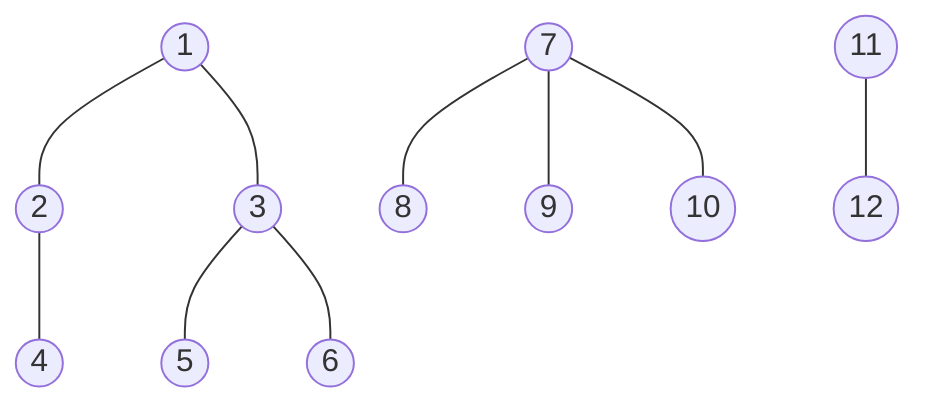

##### BFS Solution - Count Components

Here we implement our now classic BFS traversal, we iterate through our graph, and asking if the node has been visited or not.
We also need a way to count the components, to do so, we create a `count` variable, to count our components.

We have to take into account the following in order to solve this problem 

We count as + 1 component, when our queue is empty, because when we're traversing on the first node of a component and we add an element to the queue, and when the queue happened to be empty that means that we have visited all the nodes related to the first node of our for loop

On the next element of our for loop, if that element has been visited we skip it, if the next element of our for loop is a node that has not been visited, that means that we found a new component and  we need to search for its neighbors and add them to the queue.

```python
def connected_components_counts(graph):
    visited = set()
    count = 0 # we use this variable to counts our components

    # This new for loop is important, because we need to make sure that we traverse through the entire graph
    # to ensure that we visit all nodes.
    for node, neighbors in graph.items():
        queue = [node]
        if node in visited:
            continue
        while len(queue) > 0:
            currentNode = queue.pop(0)
            if currentNode in visited:
                continue
            visited.add(currentNode)
            for neighbor in graph[currentNode]:
                queue.append(neighbor)

        # We count as + 1 component, when our queue is empty, 
        #because when we're traversing on the first node of a component 
        # and we add an element to the queue, and when our queue happened
        #  to be empty that means that we have visited all the nodes 
        # related to the first node of our for loop, on the next element 
        # of our for loop, if that element has been visited we skip it, 
        # if the next element of our for loop is a node that has not 
        # been visited, that means that we found a new component and  
        # we need to search for its neighbors and add them to the queue.
        count += 1
    return count

graph = {
    1: [2, 3],
    2: [1, 4],
    3: [1, 5, 6],
    4: [2],
    5: [3],
    6: [3],
    7: [8, 9, 10],
    8: [7],
    9: [7],
    10: [7],
    11: [12],
    12: [11]
}
print(connected_components_counts(graph))
# 3
```

##### DFS Iterative Solution - Count Components

The way to solve the count components problem using a DFS algorithm is similar to the BFS version, except that we use a **stack instead of a queue**.

```python
def connected_components_counts(graph):
    visited = set()
    count = 0

    for node, neighbors in graph.items():
        stack = [node]
        if node in visited:
            continue
        while len(stack) > 0:
            currentNode = stack.pop()
            if currentNode in visited:
                continue
            visited.add(currentNode)
            for neighbor in graph[currentNode]:
                stack.append(neighbor)
        count += 1
    return count

graph = {
    1: [2, 3],
    2: [1, 4],
    3: [1, 5, 6],
    4: [2],
    5: [3],
    6: [3],
    7: [8, 9, 10],
    8: [7],
    9: [7],
    10: [7],
    11: [12],
    12: [11]
}
print(connected_components_counts(graph))
# 3
```

##### DFS Recursive Solution - Count Components

The recursive solution at first glance seems different from what we have been implementing.

The difference is that now we use a for loop, to iterate through all the nodes of the graph and then we call the function `traverse_graph` to do our classic DFS algorithm. We still need to keep track of the nodes we visit.

Now our recursive function is going to return `True` or `False`, if it is True it means that we traversed all the nodes of a component, and we add + 1 to our `count` variable.

```python
def connected_components_counts(graph):
    visited = set()
    count = 0
    # we iterate through our graph and calling the traverse function
    # on each element
    for node, neighbors in graph.items():
        if traverse_graph(node, visited, graph):
            count += 1 
    return count

def traverse_graph(currentNode, visited, graph):
    if currentNode in visited:
        return False
    visited.add(currentNode)

    for neighbor in graph[currentNode]:
        traverse_graph(neighbor, visited, graph)

    # When the recursive function reach this statement it means that it has found out component
    # and all its nodes have been marked as visited, so that we don't count them in the next
    # recursion call
    return True

graph = {
    1: [2, 3],
    2: [1, 4],
    3: [1, 5, 6],
    4: [2],
    5: [3],
    6: [3],
    7: [8, 9, 10],
    8: [7],
    9: [7],
    10: [7],
    11: [12],
    12: [11]
}
print(connected_components_counts(graph))
# 3
```

#### Largest Component

IIn this exercise we have to calculate the size of the largest component, this gives us the idea that we should initialize a variable, to keep track of the largest component so far, and that is exactly what we are going to do.

We need to write a function `get_largests_component` that takes in a `graph` as a parameter, and it must return the the size of the largest component.

For example, the graph we are going to take as an example is the one below, we can see that the maximum size of the component is 6, which is the component on the left.


##### BFS Solution - Largest Component

```python
def get_largests_component(graph):
    visited = set()
    # We use the this variale to store the size of the maximum component
    # its first value es - infinity.
    max_size = float("-inf")
    for node in graph:
        queue = [node]
        size = 0
        while len(queue) > 0:
            current_node = queue.pop(0)
            if current_node in visited:
                continue
            size += 1
            visited.add(current_node)
            for neighbor in graph[current_node]:
                queue.append(neighbor)
        # when we stop iterating throug a component
        # we need to compare its maximum value with the
        # max_size variable.
        max_size = max(max_size, size)
    return max_size


graph = {
    1: [2, 3],
    2: [1, 4],
    3: [1, 5, 6],
    4: [2],
    5: [3],
    6: [3],
    7: [8, 9, 10],
    8: [7],
    9: [7],
    10: [7],
    11: [12],
    12: [11]
}
print(get_largests_component(graph))
# 6
```

##### DFS Iterative Solution - Largest Component

As always, the difference between DFS and BFS is the use of a stack instead of a queue.

```python
def get_largests_component(graph):
    visited = set()
    max_size = float("-inf")
    for node in graph:
        stack = [node]
        size = 0
        while len(stack) > 0:
            current_node = stack.pop()
            if current_node in visited:
                continue
            size += 1
            visited.add(current_node)
            for neighbor in graph[current_node]:
                stack.append(neighbor)

        max_size = max(max_size, size)
    return max_size


graph = {
    1: [2, 3],
    2: [1, 4],
    3: [1, 5, 6],
    4: [2],
    5: [3],
    6: [3],
    7: [8, 9, 10],
    8: [7],
    9: [7],
    10: [7],
    11: [12],
    12: [11]
}
print(get_largests_component(graph))
# 6
```

##### DFS Recursive Solution - Largest Component - Variation #1

Here we will look at two variations using recursion. The first is to pass the parameter `size` to the recursive function and increment it one by one, and then compare it with the maximum value obtained from all the functions.

```python
def get_largests_component(graph):
    visited = set()
    max_size = float("-inf")
    for node, neighbors in graph.items():
        # Inicializamos el size en 0, y luego lo pasamos a la funcion traverse_graph
        size = 0
        max_size = max(max_size , traverse_graph(node, visited, graph, size))
    return max_size

def traverse_graph(currentNode, visited, graph, size):
    if currentNode in visited:
        return size
    visited.add(currentNode)
    # If the node has not been visited 
    # that means that the size must be at least 1 + previous size.
    size += 1
    for neighbor in graph[currentNode]:
        # calls to the neighbouring nodes may have different sizes,
        # but we are interested in the maximum, 
        # so we use the max() function to update the size variable.
        size = max(size, traverse_graph(neighbor, visited, graph, size))

    return size

graph = {
    1: [2, 3],
    2: [1, 4],
    3: [1, 5, 6],
    4: [2],
    5: [3],
    6: [3],
    7: [8, 9, 10],
    8: [7],
    9: [7],
    10: [7],
    11: [12],
    12: [11]
}
print(get_largests_component(graph))
# 6
```

##### DFS Recursive Solution - Largest Component - Variation #2

The difference with this variation with respect to the previous one is that now we have a base case, where if the node is visited we return zero, otherwise, the size is 1 and we add the results of the other recursive functions.

```python
def get_largests_component(graph):
    visited = set()
    max_size = float("-inf")
    for node, edges in graph.items():
        size = traverse(node, graph, visited)
        # we compare the size of the recursive call, with the max_size,
        # and then we return it
        max_size = max(max_size, size)
    return max_size
def traverse(node, graph,visited):
    # If the node es visited it means we counted already
    if node in visited:
        return 0
    visited.add(node)
    # if the node is not visited it means at least the size is one
    size = 1

    for neighbor in graph[node]:
        # we sume +1 to the sum for every new non visited node
        size +=  traverse(neighbor, graph,visited)
    return size
    
graph = {
    1: [2, 3],
    2: [1, 4],
    3: [1, 5, 6],
    4: [2],
    5: [3],
    6: [3],
    7: [8, 9, 10],
    8: [7],
    9: [7],
    10: [7],
    11: [12],
    12: [11]
}

print(get_largests_component(graph))
# 6
```

#### Shortest Path

In this exercise we must find the shortest path in an undirected graph, between two nodes.
For example consider the example below, where we can see that there are several paths to get from node 1 to node 6, these paths can be:

- 1, 3, 6
- 1, 3, 5, 6
- 1, 2, 4, 5, 6
- 1, 2, 4, 5, 3, 6

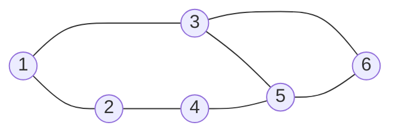

But we must consider the shortest one, we need a **notion of length/distance**, for our case, we consider that the distance between each node is 1, that is, the distance is the amount of "Edges", for example the route (1, 2, 4, 5, 6) consists of 4 edges, therefore the distance is 4.

In the example below we can see the correct shortest path, although there may be several.

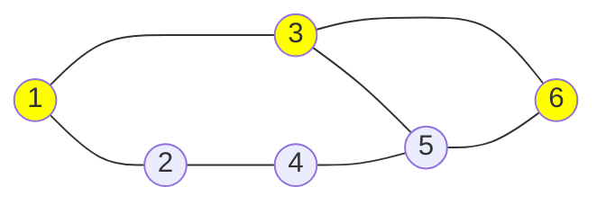

The difficulty of these exercises is that now we need to keep track, not only the nodes we visited, but also the distance from the previous node to the current one.

For example, we can start from node A, saying that the distance is 0, but when adding an element to the queue or stack, we will have to add not only the neighboring node, but also the current distance, which is zero, plus 1.

Write a function, `shortest_path`, that receives an undirected graph and two nodes, `(source, destination)`. The function should return the length of the shortest path between Source and Destination.
 Consider the length as the number of edges in the path, not the number of nodes. If there is no path between A and B, then return -1.

##### BFS Iterative Solution - Shortest Path 

If you think about it for a moment you may ask yourself, what is the best way to traverse the graph, if you look at a Depth First Search approach, it will try to traverse the graph from the beginning to the end in a single direction, where this may not be the most convenient. On the other hand, BFS, will try to expand by extending one by one the distances to the surroundings of the node, finding the solution faster.

A particularity of these exercises is that we add to the queue or stack, the node and the distance, in our case it is in the form of a tuple, that is to say `(node, distance_so_far)`, as we are doing BFS, at the moment we find the destination node, it means that we find the shortest distance,

```python
def shortest_path(graph, source, destination):
    visited = set()
    queue = [(source, 0)]

    while len(queue) > 0:
        current_node, distance = queue.pop(0)
        if current_node == destination:
            return distance
        if current_node in visited:
            continue
        visited.add(current_node)
        
        for neighbor in graph[current_node]:
            queue.append((neighbor, distance + 1))

    return -1
    
graph = {
    1: [2, 3],
    2: [1, 4],
    3: [1, 5, 6],
    4: [2, 5],
    5: [3, 4, 6],
    6: [3, 5],
}

print(shortest_path(graph, 1, 6))
# 2
```

## Graph with cycles

Now we are going to look at how to deal with problems of finding cycles in graphs, although the graphs we were looking at previously had cycles, we did not try to determine whether they contained them or not, but rather avoided them, using the **visited pattern**.

Let's refresh the concepts a bit

A cycle graph is a graph consisting of a single cycle, or in other words, a certain number of nodes connected in a closed chain.

For example, if we look at the image below, we can see that node 3 has a cycle, since from node 3 we can go to node 3 an infinite number of times, thus forming a closed chain.

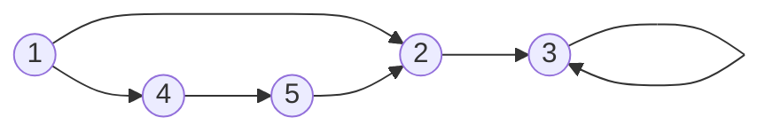

The graph below also contains a cycle, as we can go from 1 to 2 and from 2 to 1 many times, but we can also go from node 1, to node 4, from 4 to 5 and from 5 to 2 and back to 1 again.

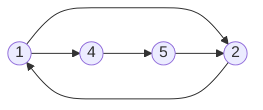


### How to find a cycle? 

You might be imagining that finding a cycle is a trivial task, since you can use the visited variable we've been using and determine that if the new node is visited it means we've found a cycle.

But that solution has a problem, we may be presented with a graph like the following.

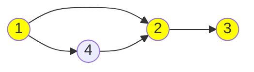

In this graph, we have explored nodes 1, 2 and 3, but node 4 has not yet been explored, when we start exploring node 4, we will arrive at node 2, and this node has been visited, but as you can see in the image, this graph does not present a cycle, so our solution would be incorrect.

The solution is to use an additional variable, which we will call it `currently_in_stack`, to keep track of the nodes we explored from our first node.

Once we have explored a path with a node, we remove it from the stack, while keeping track of the nodes visited in our `visited` variable.

As a way of illustration, suppose we explore these nodes, the value of our variables would be:

- Visited: 1, 2, 3
- Currently_in_stack: 1, 2, 3


Now we need to explore node 4, so what we do is empty the `currently_in_stack` variable, and the visited variable is left unchanged.

So when we go from node 4 to node 2, we will ask if node 2 is in the variable `currently_in_stack`, and if it is not, it means that we have not found a cycle yet. To find a cycle, what should have happened is that the node we explore must be in the variable currently_in_stack.


#### Has a cycle?

This exercise consists of finding out whether the graph has a cycle or not.

Write a function `cycle_in_graph` that has a graph as a parameter, and returns `True` if the graph contains a cycle or false if it does not have a cycle.

Feel free to try it out for yourself before jumping into the solution.


##### Has a cycle solution

In this solution we use a combination of iteration with recursion to find whether the graph has a cycle or not.

```python
def cycle_in_graph(graph):
    visited = set()
    currently_in_stack = set()

    for node in graph:
        # If the node was visited, we can skip it.
        if node in visited:
            continue
        # We call the function below, 
        # to determine if the node we are scanning has a cycle, 
        # if true, we return True.
        contains_cycle = is_node_in_cycle(graph, node, visited, currently_in_stack)
        if contains_cycle:
            return True
    return False

    
def is_node_in_cycle(graph, node, visited, currently_in_stack):
    visited.add(node)
    # We add the current node to our stack, 
    # if we explore it again and it is in the stack, it means we found a cycle.
    currently_in_stack.add(node)

    neighbors = graph[node]
    # We explore the neighbours of our current node
    for neighbor in neighbors:
        if neighbor not in visited:
            # For each of the neighbouring nodes we call the function below again, 
            # to continue exploring,
            # and return True if a cycle is found.
            contains_cycle = is_node_in_cycle(graph, neighbor, visited, currently_in_stack)
            if contains_cycle:
                return True
        # If the node we are exploring has been visited and is in the stack, 
        # it means that there is a cycle.
        elif neighbor in currently_in_stack:
            return True
    currently_in_stack.remove(node)

    return False

graph = {
    1: [2, 4],
    2: [3],
    3: [3],
    4: [5],
    5: [2]
}
print(cycle_in_graph(graph))
# True
```
## Matrix as a graph

You may not always get the nodes and edges of a graph, you may get a **grid**, in which case it is still possible to think of a problem with a grid as if it were a graph.

For example we can, think of the position of a cell (row, col), as if it were the node, and we can consider that a node can move, **up**, **down**, **left**, **right**, i.e. it has at most 4 neighbors.

For example consider the grid below, the node would be, with index zero, row 3 and column 2, that is (3, 2), and the neighbors would be the arrows.


The problem with these grids is that when finding our neighbors, we must consider not to go out of the grid.

If our position is (row, col), our neighbors would be:

- Up: (row - 1, col)
- Down: (row + 1, col)
- Right: (row, col + 1)
- Left: (row, col - 1)

### Problems with islands 🏝

Now we are going to look at two typical grid problems, which consist of counting the islands and finding the largest island. I will start by first explaining how to count the islands.

#### Count the islands

This problem consists of counting how many islands there are in the grid. The water will be represented in blue and the land in yellow, the idea is to consider an island as any set of yellow cells that are next to each other. If we look at the grid below, we will see that there are 4 islands, but how do we solve this problem?


The input parameter of our problem will be a grid of the following style:

Where :
- W = Water 
- L = Land.

```python
grid = [
    ["W", "L", "W", "W", "L", "L"],
    ["W", "W", "W", "W", "W", "W"],
    ["W", "W", "W", "W", "L", "W"],
    ["W", "L", "L", "W", "L", "L"],
    ["W", "L", "L", "W", "L", "W"],
    ["W", "W", "W", "W", "W", "W"],
]
```


You have probably noticed that what we have to do is to iterate this grid to access the cells, and then ask if it is water, we do nothing, and if it is a land, we must mark it as visited.

As we find land, we must also find the neighboring nodes, through BFS or DFS, we must also ask if the neighboring nodes are water or land, and if they are land, we must explore their neighbors and so on.


It is important to mark neighboring nodes as visited, so that in the next iteration of our for loop, we ask if the current cell is water or the land has been visited, if that is the case, we skip them.


The problem statement is as follows:

Write a function, `island_count`, that takes in a grid containing Ws and Ls. W represents water and L represents land. The function should return the number of island on the grid. An island is a vertically or horizontally connected region of land

##### BFS Iterative Solution - Count the islands

Here we are going to use a BFS algorithm to solve the problem, the difference with the previous exercises is that we are going to have an additional loop to iterate through the grid, then we will ask if the cell is water or land, if it is water we do nothing, or if we already visited it we do nothing. 

Another difference is that we are going to store in the variable `visited` the position of the cell, as a tuple `(row, col)`, but feel free to use whatever you want, it could also be an array `[row, col]`.

We also create an additional function called `get_neighbors`, to get the neighboring nodes to the current cell, being careful not to get an out of bounds error.


```python
WATER = "W"
LAND = "L"
def island_count(grid):
    visited = set()
    islands = 0
    # With this nested for loop, we iterate through our grid
    for row in range(len(grid)):
        for col in range(len(grid[0])):
            # We continue if the cell is watter
            if grid[row][col] == WATER:
                continue
            # we also continue if the cell has been visited
            if (row, col) in visited:
                continue
            # If we reach this line, it means that we found an island,
            # our next step is to keep exploring this island,
            # and mark of its adjancent cells as visited, so we can 
            # skip them in the next iteration of the foor loop
            islands += 1
            explore_land(grid, row, col, visited)

    return islands

def explore_land(grid, row, col, visited):

    queue = [(row, col)]
    while len(queue) > 0:
        row, col = queue.pop(0)
        #We check if the node has been visited, 
        # if so we skip it.
        if (row, col) in visited:
            continue
        # We mark the node as visited, and check if 
        # the current node is water, if so we skip it.
        visited.add((row, col))
        if grid[row][col] == WATER:
            continue
        # We get the neighboring nodes of 
        # the current node, and then add them to the queue.
        neighbors = get_neigbors(grid, row, col)
        for neighbor in neighbors:
            queue.append(neighbor)

def get_neigbors(grid, row, col):
    # We get the nodes around the current node. 
    neighbors = []
    # Up
    if row - 1 >= 0:
        neighbors.append((row - 1, col))
    # Down
    if row + 1 < len(grid):
        neighbors.append((row + 1, col))
    # Left
    if col - 1 >= 0:
        neighbors.append((row, col - 1))
    # Rigth
    if col + 1 < len(grid[0]):
        neighbors.append((row, col + 1))

    return neighbors

grid = [
    ["W", "L", "W", "W", "L", "L"],
    ["W", "W", "W", "W", "W", "W"],
    ["W", "W", "W", "W", "L", "W"],
    ["W", "L", "L", "W", "L", "L"],
    ["W", "L", "L", "W", "L", "W"],
    ["W", "W", "W", "W", "W", "W"],
]
print(island_count(grid))
# 4
```

##### DFS Recursive Solution - Count the islands 

The recursive solution has the particularity that it will have more base cases, where it will check not to have an out of bound situation.

Also, the recursive function will take care of adding the neighboring nodes as visited.

```python
WATER = "W"
LAND = "L"
def island_count(grid):
    visited = set()
    island = 0
    for row in range(len(grid)):
        for col in range(len(grid[0])):
            # We iterate the grid with a double 
            # for loop and call the explore_land 
            # function with each node.
            # This function returns true or false, 
            # true means it found an island and 
            # we can add it to our variable "island".
             if explore_land(grid, row, col, visited):
                island += 1
    return island

def explore_land(grid, row, col, visited):
    # we check if the node is out of bounds or not, 
    # if true, we return true
    is_row_in_bounds = row >= 0 and row < len(grid)
    is_col_in_bounds = col >= 0 and col < len(grid[0])
    if is_row_in_bounds is not True or is_col_in_bounds is not True:
        return False
    #If the current node is water we return false
    if grid[row][col] ==  WATER:
        return False

    # we grab the current position and check if the node
    # has been visited
    position = (row, col)
    if position in visited:
        return False
    visited.add(position)

    # We call the recursive function, 
    # passing as parameter the possible positions of the neighboring nodes.
    explore_land(grid, row - 1, col, visited)
    explore_land(grid, row + 1, col, visited)
    explore_land(grid, row, col - 1, visited)
    explore_land(grid, row, col + 1, visited)

    # when we reach this statement, it means we found an island
    return True

grid = [
    ["W", "L", "W", "W", "L", "L"],
    ["W", "W", "W", "W", "W", "W"],
    ["W", "W", "W", "W", "L", "W"],
    ["W", "L", "L", "W", "L", "L"],
    ["W", "L", "L", "W", "L", "W"],
    ["W", "W", "W", "W", "W", "W"],
]
print(island_count(grid))
# 4
```

#### Largest Island

This problem is similar to the previous one, with the particularity that we must slightly change our function to keep track of the largest island we have found.

Write a function, `largest_island`, that takes in a grid containing Ws and Ls. W represents water and L, represents Land.
The function should return the size of the largest island. An island is a vertically or horizontally connected region of land.

Feel free to try it out for yourself before jumping into the solution.

##### BFS Iterative Solution - Largest Island

The iterative BFS solution is similar to the previous one, with the main difference being that we count the length of the island in the `explore_land function`, and then compare it to our `max_island` variable.

```python
WATER = "W"
LAND = "L"
def largest_island(grid):
    visited = set()
    # Variable to keep track of the largest island
    max_island = float("-inf")
    for row in range(len(grid)):
        for col in range(len(grid[0])):
            if grid[row][col] == WATER:
                continue
            if (row, col) in visited:
                continue
            # Iterate the grid and call the explore_land function,
            # which will return the size of the island found, 
            # and then compare it with our max_island variable.
            max_island = max(max_island, explore_land(grid, row, col, visited))

    return max_island

def explore_land(grid, row, col, visited):
    max_island = 0
    queue = [(row, col)]
    while len(queue) > 0:
        row, col = queue.pop(0)
        if (row, col) in visited:
            continue
        visited.add((row, col))
        if grid[row][col] == WATER:
            continue
        # We add 1 to our variable for each land node we find, 
        # then look for the neighbours of the current land node.
        max_island +=1
        neighbors = get_neigbors(grid, row, col)
        for neighbor in neighbors:
            queue.append(neighbor)
    return max_island
    
def get_neigbors(grid, row, col):
    neighbors = []
    # Up
    if row - 1 >= 0:
        neighbors.append((row - 1, col))
    # Down
    if row + 1 < len(grid):
        neighbors.append((row + 1, col))
    # Left
    if col - 1 >= 0:
        neighbors.append((row, col - 1))
    # Rigth
    if col + 1 < len(grid[0]):
        neighbors.append((row, col + 1))

    return neighbors

grid = [
    ["W", "L", "W", "W", "W"],
    ["W", "L", "W", "W", "W"],
    ["W", "W", "W", "L", "W"],
    ["W", "W", "L", "L", "W"],
    ["L", "W", "W", "L", "L"],
    ["L", "L", "W", "W", "W"],
]
print(largest_island(grid))
# 5
```

##### DFS Recursive Solution - Largest Island

The main difference between the solution of counting the islands and getting the largest island by recursion, is that now we have to add up the sizes of the islands we find, and then compare them with our `max_size` variable.

```python
WATER = "W"
LAND = "L"
def largest_island(grid):
    visited = set()
    max_size = float("-inf")
    for row in range(len(grid)):
        for col in range(len(grid[0])):
            current_size = explore_land(grid, row, col, visited)
            if current_size > 0:
                max_size = max(max_size, current_size)
    return max_size

def explore_land(grid, row, col, visited):
    is_row_in_bounds = row >= 0 and row < len(grid)
    is_col_in_bounds = col >= 0 and col < len(grid[0])
    if is_row_in_bounds is not True or is_col_in_bounds is not True:
        return 0
    if grid[row][col] ==  WATER:
        return 0

    position = (row, col)
    if position in visited:
        return 0
    visited.add(position)

    size = 1
    # Here we start with a size of 1 for the first piece of land, 
    # then add 1 if the recursive function calls return 1 for its neigbors, 
    # then return total size
    size += explore_land(grid, row - 1, col, visited)
    size += explore_land(grid, row + 1, col, visited)
    size += explore_land(grid, row, col - 1, visited)
    size += explore_land(grid, row, col + 1, visited)

    return size


grid = [
    ["W", "L", "W", "W", "W"],
    ["W", "L", "W", "W", "W"],
    ["W", "W", "W", "L", "W"],
    ["W", "W", "L", "L", "W"],
    ["L", "W", "W", "L", "L"],
    ["L", "L", "W", "W", "W"],
]
print(largest_island(grid))
# 5
```

## Conclusion

If you have reached this point, it means that you have learnt the following:

- How to explore a graph using Breadth-First-Search.
- How to explore a graph using Depth-First-Search.
- You learned not to fall into infinite loops by using the visited pattern.
- You know how to tackle problems with grids as if they were graphs.
- You know how to apply recursive and iterative solutions.

Congratulations you have learned the basic building blocks to tackle any problem with graphs, I wish you all the best in your future coding interviews 😉.