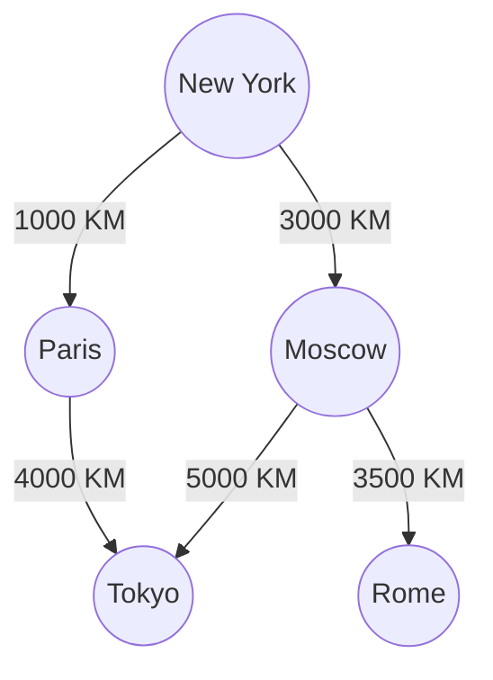
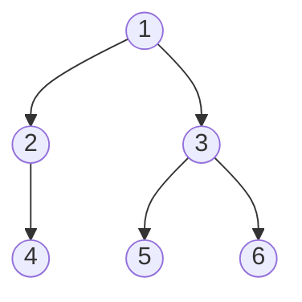
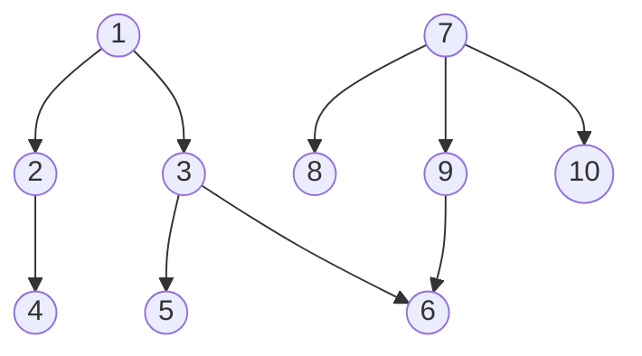
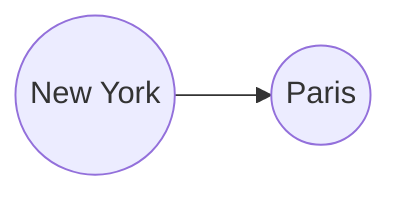
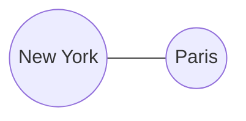
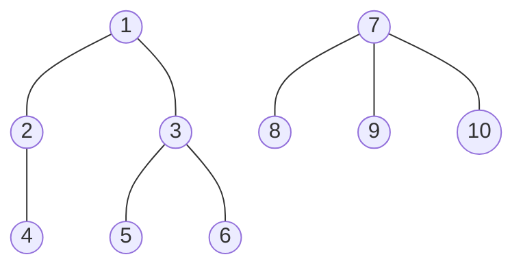
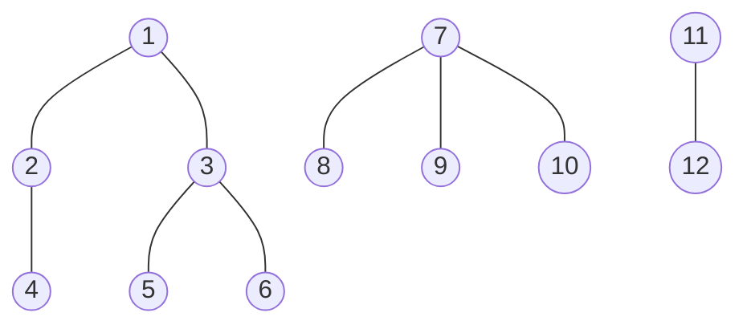

+++
categories = ["Programming"]
date = 2022-09-14T03:00:00Z
description = "Don't you know what a Data Class is? You know how to use it? And what is the difference with a regular class? Here in this post I will try to answer these questions and many more."
image = "/uploads/post/why-you-should-use-dataclasses-in-python/cover.jpg"
tags = ["Python"]
title = "Understanding Graph Problems"
type = "post"
+++

Don't you know what a Data Class is? You know how to use it? And what is the difference with a regular class? Here in this post I will try to answer these questions and many more.

## What is a Graph?


A Graph is a data structure consisting of `NODES` (or vertices) and `EDGES`. This data structure is often use as a way to represent distances or different connections.
For example the distances between cities, with arbitrary distances


With a graph you can know things like, the distance from New York to Paris, and from Paris to Tokyo, also, thanks to the graph you know that if you can go from New York to Paris and from Paris to Tokyo, you can go from New York to Tokyo.

- **Nodes:** a node (normally the circles in the graph) can have a value, for example a letter or a number, or have not value at all.
- **Edges:** the edges (or arrows) are the lines that connect one node with another one. An edge can have a value, this value may represent some sort o distance.


More formally a Graph is composed of a set of Nodes(N) and a set of edges(E).


## Graph in the context of coding interviews

Graph are often a topic present in coding interviews, so here I want to show you how to tackle these problems and the different patterns that you need to know or be aware of.


## How do you traverse a graph?

When traversing a graph there are two main techniques, known as Breadth-First-Search Depth-First-Search, this is the fundamental block that you will use in most graph problems.

### Breadth-First-Search (BFS)

Breadth-First-Search (BFS) is an algorithm for searching a tree data structure for a node that satisfies a given property.
It starts at the tree root (or the node that you want) and explores all nodes at the present depth prior to moving on to the nodes at the next depth level.
Extra memory, usually a **queue**, is needed to keep track of the child nodes that were encountered but not yet explored.



The result of the BFS algorithm will be **--> 1, 2, 3, 4, 5, 6.**

To implement a BFS algorithm, you have to follow the next steps:

- Declare a queue and insert the starting node.
<!-- - Initialize a visited array and mark the starting vertex as visited. -->
- While the queue is not empty you remove the first node of the queue.
<!-- - Mark that vertex as visited.
 -->
- Insert all the neighbors of the node into the queue.

**All of the algorithms will be presented in python, feel free to implement them in your favorite language**

#### BFS Code implementation

```python
def breadth_first_search(graph,starting_node):
    queue = [starting_node] # Declare a queue and insert the starting node.
    while len(queue) > 0: # While the queue is not empty you remove the first node of the queue.
        current_node = queue.pop(0) 
        print(current_node)
        for neighbor in graph[current_node]:
            queue.append(neighbor) # Insert all the neighbors of the node into the queue.

graph = {
    1: [2, 3],
    2: [4],
    3: [5, 6],
    4: [],
    5: [],
    6: [],
}
breadth_first_search(graph, 1)
# 1 2 3 4 5 6
```

### Depth-First-Search (DFS)

Depth-First-Search (DFS) is an algorithm for traversing or searching tree or graph data structures.
The algorithm starts at the root node (selecting some arbitrary node as the root node in the case of a graph) and explores as far as possible along each branch before backtracking.
Extra memory, usually a stack, is needed to keep track of the nodes discovered so far along a specified branch which helps in backtracking of the graph.


The result of the DFS algorithm will be **--> 1, 3, 6, 5, 2, 4.**

To implement a DFS algorithm, you have to follow the next steps:

For the **iterative solution**:

- Declare a stack and insert the starting node.
- While the stack is not empty you remove the last node of the stack.
- Insert all the neighbors of the node into the queue.

For the **recursive solution**:

- Create a recursive function that takes in the graph and the starting node.
- Create your base cases.
- Traverse all the neighbor nodes and call the recursive function with the index of the neighbor node.

#### DFS Code implementation, Iterative

```python
def breadth_first_search(graph,starting_node):
    queue = [starting_node] # Declare a stack and insert the starting node.
    while len(queue) > 0: # While the stack is not empty you remove the last node of the stack.
        current_node = queue.pop() 
        print(current_node)
        for neighbor in graph[current_node]:
            queue.append(neighbor) # Insert all the neighbors of the node into the queue.

graph = {
    1: [2, 3],
    2: [4],
    3: [5, 6],
    4: [],
    5: [],
    6: [],
}
breadth_first_search(graph, 1)
# 1 3 6 5 2 4  # It does not matter if you start with the right neighbor or with the left one
```

#### DFS Code implementation, Recursion

```python
def breadth_first_search(graph,starting_node):
    # Create a recursive function that takes in the graph and the starting node.
    print(starting_node)
    for neighbor in graph[starting_node]: 
        # Create your base cases. In this case my base is when the for loop contains zero elements.
        # When that is the case I do not call the breadth_first_search function
        # Traverse all the neighbor nodes and call the recursive function with the index of the neighbor node.
        breadth_first_search(graph, neighbor)

graph = {
    1: [2, 3],
    2: [4],
    3: [5, 6],
    4: [],
    5: [],
    6: [],
}
breadth_first_search(graph, 1)
# 1 3 6 5 2 4 
```

## Adjacency as my Graph representation

## Let's practice the traversal

Now we need to put into practice what we have learned with an exercise.

### Has path?

We are going to write a function **has_path** that takes and dictionary or object representing the adjacency list of a graph, and my parameter will be **(starting_node, destination)**.
The function must return a *True* value whether there is a directed path between the source node and the destination node, otherwise we should return **False**

This is the input graph



#### Has path Code implementation

We are going to implement the solution using BFS and DFS (recursively and iteratively).

The process is quite straightforward, we need to implement the same algorithm we implemented above, but searching for the destination node.
Feel free to give it a try on your own before jump into the solution 😋.

##### BFS Iterative Solution

```python
def has_path(graph, starting_node, destination):
    # The first think we do is to ask if the starting node and destination are the same
    if starting_node == destination: 
        return True
    queue = [starting_node]
    while len(queue) > 0:
        current_node = queue.pop(0) 
        if current_node == destination:
            # We keep asking if they are the same with every new node in the queue
            return True
        for neighbor in graph[current_node]:
            queue.append(neighbor)

    # If we couldn't find the destination node from the starting node 
    # we return false
    return False

graph = {
    1: [2, 3],
    2: [4],
    3: [5, 6],
    4: [],
    5: [],
    6: [],
    7: [8, 9, 10],
    8: [],
    9: [6],
    10: [],
}
has_path(graph, starting_node = 7, destination = 6)
# True
```

##### DFS Iterative Solution

As we can see, this is essentially the same code, except with an stack instead of a queue data structure.

```python
def has_path(graph, starting_node, destination):
    # The first think we do is to ask if the starting node and destination are the same
    if starting_node == destination: 
        return True
    stack = [starting_node] # the only difference with a BFS is the stack
    while len(stack) > 0:
        current_node = stack.pop() 
        if current_node == destination:
            # We keep asking if they are the same with every new node in the queue
            return True
        for neighbor in graph[current_node]:
            stack.append(neighbor)

    # If we couldn't find the destination node from the starting node 
    # we return false
    return False
    
graph = {
    1: [2, 3],
    2: [4],
    3: [5, 6],
    4: [],
    5: [],
    6: [],
    7: [8, 9, 10],
    8: [],
    9: [6],
    10: [],
}
has_path(graph, starting_node = 7, destination = 6)
# True
```

##### DFS Recursive Solution

Here we are going to implement the DFS algorithm using a recursive approach.

```python
def has_path(graph, starting_node, destination):
    # The first think we do is to ask if the starting node and destination are the same
    if starting_node == destination: 
        return True
    for neighbor in graph[starting_node]:
        # Here we call the same function, has_path, for all of the neighbors of a given node
        # This function return true or false if we find such node.
        if has_path(graph, neighbor, destination):
            return True

    # If we couldn't find the destination node from the starting node 
    # we return false
    return False
    
graph = {
    1: [2, 3],
    2: [4],
    3: [5, 6],
    4: [],
    5: [],
    6: [],
    7: [8, 9, 10],
    8: [],
    9: [6],
    10: [],
}
has_path(graph, starting_node = 7, destination = 6)
# True
```

## Undirected Graph and the Visited Pattern

So far we have seen directed graph, that is, a from one node to another node there is only one direction, consider the next example:


In this example you can go from New York to Paris, but not the other way around.


An undirected graph is graph, where all the edges are bidirectional.



In this example 👆, you can go from New York to Paris, and from Paris to New York.

But what is the **Visited Pattern**?

As you can imagine, now we need to find some way to know which nodes we visit and which we don't, so we can avoid infinite loops.

Generally a solution to this is to use a set, which allows us to have constant lookups, that is access to an element in constant time.

Let's practice some exercises.

### Exercises

Here we will practice some exercises using BFS and DFS, and we will implement the visited pattern.
Again, feel free to try to solve these exercises on your own before jump into the code.

I will explain in the code the new lines that we need to solve the problem and potential gotchas.

#### Find path Between node A and B in a undirected Graph

This problem is similar to the **Has Path** problem presented above, but with the difference that we have an undirected node, so we have to pay attention to the nodes we visit, in order not to fall into an infinite loop.

We are going to write a function **has_path** that takes and dictionary or object representing the adjacency list of a graph, and my parameter will be **(starting_node, destination)**.
The function must return a *True* value whether there is a directed path between the source node and the destination node, otherwise we should return **False**

Our input graph is the following:



The new concepts to keep in mind are the following:

- We need to create a data structure to keep track of the visited node, typically a **set**.
- When we loop through the neighbors of our current node, we need to ask if that node has already been visited.
- If the node has been visited, we skip the node (this may depend of the problem).
- After we check that our node has not been visited yet, we mark it as visited.

##### BFS Solution - Has Path - Undirected Graph

We implement the BFS algorithm as we have seen before, but we add a new element, the visited set, to keep track of our visited nodes.

```python
def has_path(graph, starting_node, destination):
    visited = set() # Set to keep track our visited nodes
    if starting_node == destination:
        return True
    queue = [starting_node]
    while len(queue) > 0:
        current_node = queue.pop(0) 

        # Ask if our current node has been visited
        # if it has been visited, we skip this node
        if current_node in visited: 
            continue
        # add our current node to the visited set
        visited.add(current_node) 

        if current_node == destination:
            return True
        for neighbor in graph[current_node]:
            queue.append(neighbor)

    return False
graph = {
    1: [2, 3],
    2: [1, 4],
    3: [1, 5, 6],
    4: [2],
    5: [3],
    6: [3],
    7: [8, 9, 10],
    8: [7],
    9: [7],
    10: [7],
}
has_path(graph, starting_node = 2, destination = 6)
# True
```

##### DFS Iterative Solution - Has Path - Undirected Graph

This solution is similar to the BFS approach, but using an stack instead of a queue.

```python
def has_path(graph, starting_node, destination):
    visited = set() # Set to keep track our visited nodes
    if starting_node == destination:
        return True
    stack = [starting_node] #We use a stack instead of a queue for the DFS algorithm
    while len(stack) > 0:
        current_node = stack.pop() 

        # Ask if our current node has been visited
        # if it has been visited, we skip this node
        if current_node in visited: 
            continue
        # add our current node to the visited set
        visited.add(current_node) 

        if current_node == destination:
            return True
        for neighbor in graph[current_node]:
            stack.append(neighbor)

    return False
graph = {
    1: [2, 3],
    2: [1, 4],
    3: [1, 5, 6],
    4: [2],
    5: [3],
    6: [3],
    7: [8, 9, 10],
    8: [7],
    9: [7],
    10: [7],
}
has_path(graph, starting_node = 2, destination = 6)
# True
```

##### DFS Recursive Solution - Has Path - Undirected Graph - Variation # 1

We implement a recursive approach to look for the visited nodes, we also add a new parameter to our function, a set, to keep track of the node that we have seen.

```python
# We add a new parameter called visited, to keep track of our visited nodes.
# We pass an empty visited set to our function for the first time.
def has_path(graph, starting_node, destination, visited = set()):
    # The first think we do is to ask if the starting node and destination are the same
    if starting_node == destination: 
        return True
    # we checked if our starting node has been visited, if it has
    # we return False
    if starting_node in visited:
        return False
    visited.add(starting_node)
    for neighbor in graph[starting_node]:
        if has_path(graph, neighbor, destination, visited):
            return True

    return False

graph = {
    1: [2, 3],
    2: [1, 4],
    3: [1, 5, 6],
    4: [2],
    5: [3],
    6: [3],
    7: [8, 9, 10],
    8: [7],
    9: [7],
    10: [7],
}
has_path(graph, starting_node = 10, destination = 8)
# True
```

##### DFS Recursive Solution - Has Path - Undirected Graph - Variation # 2

This is a slight variation of the recursive DFS recursive approach.
The main difference is that we check if the node has been visited when we loop the neighbors of our current Node

```python
def has_path(graph, starting_node, destination, visited = set()):
    # The first think we do is to ask if the starting node and destination are the same
    if starting_node == destination: 
        return True
    for neighbor in graph[starting_node]:
        # We ask if our neighbor node has been visited
        if neighbor in visited:
            continue
        # we mark our neighbor has visited, so that in the next recursion call
        # we ask if it is the node that we are looking for
        visited.add(neighbor)
        if has_path(graph, neighbor, destination, visited):
            return True

    return False

graph = {
    1: [2, 3],
    2: [1, 4],
    3: [1, 5, 6],
    4: [2],
    5: [3],
    6: [3],
    7: [8, 9, 10],
    8: [7],
    9: [7],
    10: [7],
}
has_path(graph, starting_node = 10, destination = 8)
# True
```

#### Count Components

In this exercise we will have to count the components that are connected. For instance, that a look at the example below 👇. As you see, there are 3 components.
So our objective consists of counts how many components our graph has.

We need to write a function **connected_components_counts(graph)** that takes in a **graph** as a parameter, and it must return the number of components that the graph has, or zero if it has none.

This problem has the particularity that we have to iterate through all the nodes of the graph, because if not, we will not know if they are all connected,  or if we are missing any of them.



##### BFS Solution - Count Components

Here we implement our now classic BFS traversal, we iterate through our graph, and asking if the node has been visited or not.
We also need a way to count the components, to do so, we create a `count` variable, to count our components.

We have to take into account the following in order to solve this problem 

- We count as + 1 component, when our queue is empty, because when we're traversing on the first node of a component and we add an element to the queue, and when our queue happened to be empty that means that we have visited all the nodes related to the first node of our for loop, on the next element of our for loop, if that element has been visited we skip it, if the next element of our for loop is a node that has not been visited, that means that we found a new component and  we need to search for its neighbors and add them to the queue.

```python
def connected_components_counts(graph):
    visited = set()
    count = 0 # we use this variable to counts our components

    # This new for loop is important, because we need to make sure that we traverse through the entire graph
    # to ensure that we visit all nodes.
    for node, neighbors in graph.items():
        queue = [node]
        if node in visited:
            continue
        while len(queue) > 0:
            currentNode = queue.pop(0)
            if currentNode in visited:
                continue
            visited.add(currentNode)
            for neighbor in graph[currentNode]:
                queue.append(neighbor)

        # We count as + 1 component, when our queue is empty, 
        #because when we're traversing on the first node of a component 
        # and we add an element to the queue, and when our queue happened
        #  to be empty that means that we have visited all the nodes 
        # related to the first node of our for loop, on the next element 
        # of our for loop, if that element has been visited we skip it, 
        # if the next element of our for loop is a node that has not 
        # been visited, that means that we found a new component and  
        # we need to search for its neighbors and add them to the queue.
        count += 1
    return count

graph = {
    1: [2, 3],
    2: [1, 4],
    3: [1, 5, 6],
    4: [2],
    5: [3],
    6: [3],
    7: [8, 9, 10],
    8: [7],
    9: [7],
    10: [7],
    11: [12],
    12: [11]
}
print(connected_components_counts(graph))
# 3
```

##### DFS Iterative Solution - Count Components

The way to solve the count components problem using a DFS algorithm is similar to the BFS version, except that we use a stack instead of a queue.

```python
def connected_components_counts(graph):
    visited = set()
    count = 0

    for node, neighbors in graph.items():
        stack = [node]
        if node in visited:
            continue
        while len(stack) > 0:
            currentNode = stack.pop()
            if currentNode in visited:
                continue
            visited.add(currentNode)
            for neighbor in graph[currentNode]:
                stack.append(neighbor)
        count += 1
    return count

graph = {
    1: [2, 3],
    2: [1, 4],
    3: [1, 5, 6],
    4: [2],
    5: [3],
    6: [3],
    7: [8, 9, 10],
    8: [7],
    9: [7],
    10: [7],
    11: [12],
    12: [11]
}
print(connected_components_counts(graph))
# 3
```

##### DFS Recursive Solution - Count Components

The recursive solution at first glance seems different from what we have been implementing.

The difference is that now we use a for loop, to iterate through all the nodes of the graph and then we call the function **traverse_graph** to do our classic DFS algorithm. We still need to keep track of the nodes we visit.

Now our recursive function is going to return True or False, if it is True it means that we traversed all the nodes of a component, and we add + 1 to our `count` variable.

```python
def connected_components_counts(graph):
    visited = set()
    count = 0
    # we iterate through our graph and calling the traverse function
    # on each element
    for node, neighbors in graph.items():
        if traverse_graph(node, visited, graph):
            count += 1 
    return count

def traverse_graph(currentNode, visited, graph):
    if currentNode in visited:
        return False
    visited.add(currentNode)

    for neighbor in graph[currentNode]:
        traverse_graph(neighbor, visited, graph)

    # When the recursive function reach this statement it means that it has found out component
    # and all its nodes have been marked as visited, so that we don't count them in the next
    # recursion call
    return True

graph = {
    1: [2, 3],
    2: [1, 4],
    3: [1, 5, 6],
    4: [2],
    5: [3],
    6: [3],
    7: [8, 9, 10],
    8: [7],
    9: [7],
    10: [7],
    11: [12],
    12: [11]
}
print(connected_components_counts(graph))
# 3
```

#### Largest Component

#### Shortest Path

#### The graph has a cycle?

## Matrix as a graph

### Problems with islands 🏝

#### Count the islands

#### Largest Island

## Conclusion

